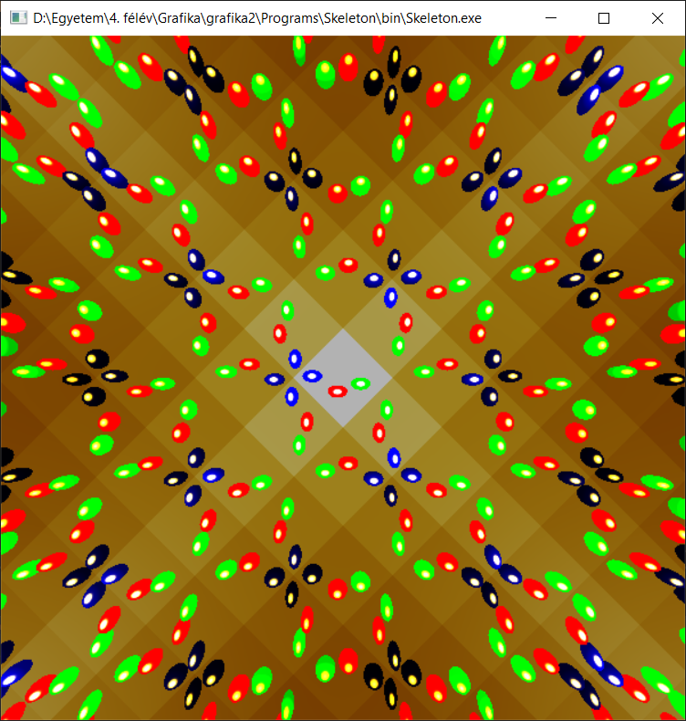

# Grafika 2. házi feladat

## Feladatleírás

Készítsen virtuális kaleidoszkópot. A tükörrendszer szabályos sokszög, amelynek az oldalszáma 3-ról indul és az ‘a’ billentyűvel lehet inkrementálni. A tükör anyaga arany (‘g’) vagy ezüst (‘s’). A kaleidoszkóp végén legalább három, különböző anyagtulajdonságú ellipszoid található, amelyet ambiens+diffúz+Phong-Blinn spekuláris modell szerint veri vissza a fényt. Az ellipszoidokat véletlen erők érik (Brown mozgás) amit követve mozognak.

Screenshot:

